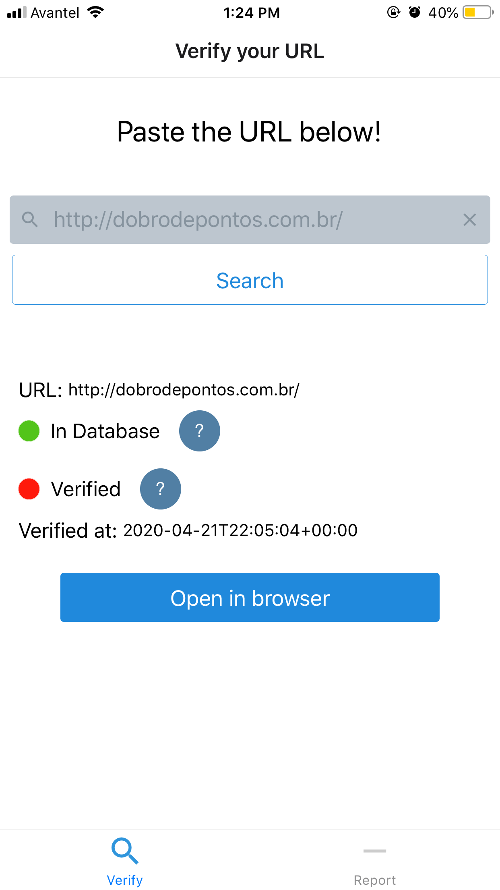
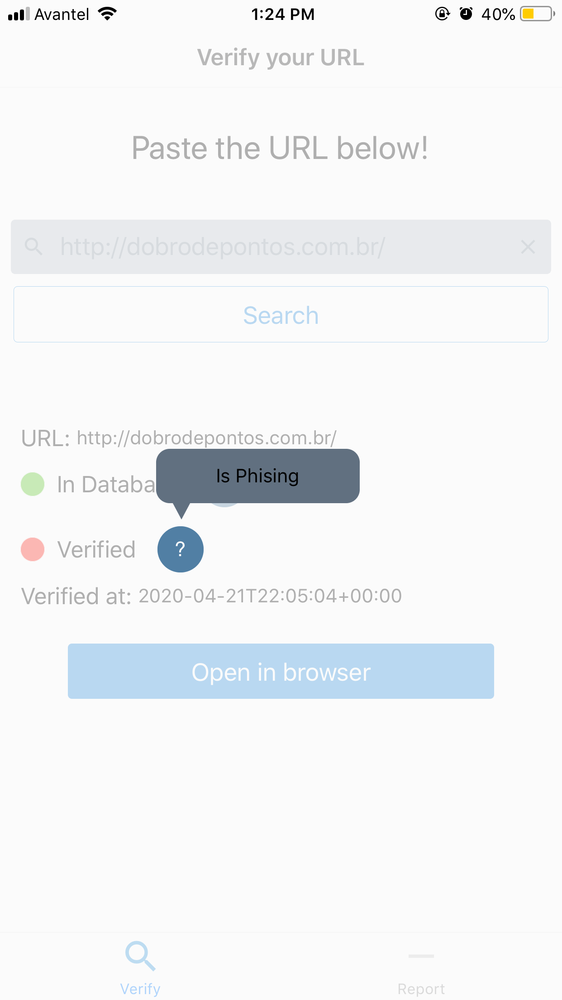
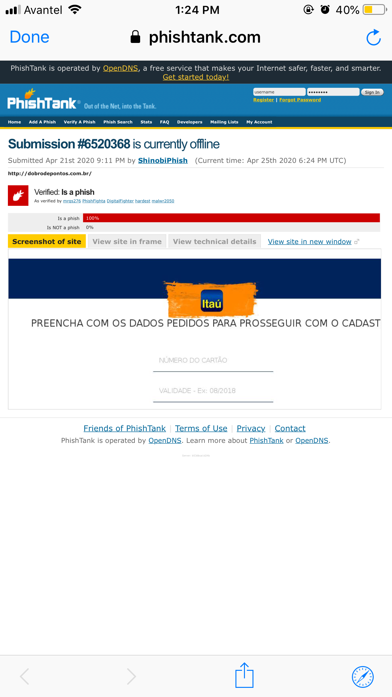

# PhishingApp
Simple phising React-Native Expo app where you can test your URLs with PhishTank.

# How to use
You test it using the command
    
    expo start
    

Remember add the API Key of PhishTank in *app.json*
    
    "extra": {
      "PhishTankKey":"6f2a7a02d9ea36ef4axxxxxxxxxx"
    }

Some view samples

